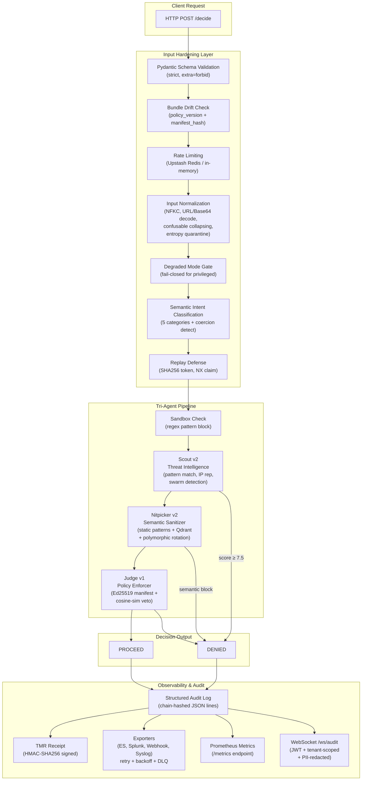

<p align="center">
  
</p>

<h1 align="center">Aletheia Core</h1>

<p align="center">
  <strong>Runtime audit and pre-execution block layer for AI agents.</strong><br/>
  Signed policy enforcement, semantic threat detection, tamper-evident audit receipts.
</p>

<p align="center">
  <a href="https://app.aletheia-core.com">Website</a> &middot;
  <a href="https://app.aletheia-core.com/demo">Live Demo</a> &middot;
  <a href="https://aletheia-core.com">Docs</a> &middot;
  <a href="SECURITY.md">Security Policy</a>
</p>

<p align="center">
  
  
  
  
  
</p>

---

## Why Aletheia Core

Autonomous AI agents manage CI/CD pipelines, financial transactions, and critical infrastructure.
A single compromised dependency can silently exfiltrate credentials from production environments.
Existing guardrails operate at the token level — they cannot detect semantically camouflaged
instructions or verify policy integrity at runtime.

Aletheia provides a **runtime enforcement layer** that interposes between AI agents and the
actions they request. Every action is verified against a cryptographically signed policy
manifest, analyzed for semantic similarity to known attack patterns, and logged with a
tamper-evident audit receipt — before it is allowed to execute.

**Key properties:**

- Ed25519-signed policy manifest — tamper triggers hard veto
- Semantic intent veto — cosine similarity against 50+ camouflage phrases
- HMAC-signed audit receipts on every decision
- Fail-closed design — invalid manifest or unverifiable action = automatic DENIED
- MIT open source — read every line that determines an allow or block

---

## What's New in v1.9.2

### Deployment Fixes

- **`asyncpg` added as core dependency**: Resolves `ModuleNotFoundError` on Python 3.14 / Render deployments with Postgres backends.
- **`ALETHEIA_MODE` parsing hardened**: Normalized whitespace and slash-delimited placeholder values (e.g. `active / shadow / monitor`) are rejected at startup; only `active`, `shadow`, or `monitor` are accepted.
- **`ALETHEIA_MANIFEST_KEY_VERSION` documented**: Startup failure (`ManifestTamperedError: key version mismatch`) resolved by ensuring env var matches the `key_version` field in `manifest/security_policy.json.sig` (`v1`).
- **Frontend API route fix** (`app/api`): Corrected TypeScript route handler for Next.js 14 app directory.
- **Dependency hash pinning**: `asyncpg` hash added to `requirements.txt` lock.

### Launch Transition

- **Hosted API status set to live**: construction banner now auto-hides in production state.
- **Pricing terminology updated**: public copy now uses Sovereign Audit Receipts / verified decisions.
- **Tier model update**: hosted tiers are now Free, Scale, Pro, and PAYG (Stripe-backed).
- **Checkout/webhook tier mapping**: checkout supports `tier=scale|pro|payg`; webhook fulfillment maps tiers to internal hosted plans.

### What was new in v1.9.0

- Qdrant semantic layer, symbolic narrowing, `NitpickerResult` dataclass, 24 static blocked patterns, 51 new semantic tests, pre-commit hooks, RBAC for admin endpoints, `ALETHEIA_API_KEYS` / `ALETHEIA_ADMIN_KEY` / `ALETHEIA_LOG_PII` env vars removed.

See [CHANGELOG.md](CHANGELOG.md) for full history.

---

## Security Status

| Metric                         | Value                                       |
| ------------------------------ | ------------------------------------------- |
| Audit status                   | **PASS**                                    |
| Tests passing                  | 1114 passed, 16 skipped                     |
| Blocked semantic patterns      | 24 (static) + Qdrant extended               |
| Semantic alias phrases (Judge) | 60+ across 6 restricted categories          |
| Core coverage                  | 89%                                         |
| SAST findings                  | 0                                           |
| Hardcoded secrets              | 0                                           |
| Dependency hash pinning        | Enforced (`--require-hashes` in Dockerfile) |

---

## Quick Start

### Try the live demo (no install)

[**app.aletheia-core.com/demo**](https://app.aletheia-core.com/demo) — no API key required.

### Install

```bash
pip install aletheia-cyber-core
```

#### Optional Consciousness Proximity Module

To enable the optional proximity feature set:

```bash
pip install -r requirements-proximity.txt
export CONSCIOUSNESS_PROXIMITY_ENABLED=true
```

The proximity module is gated behind `CONSCIOUSNESS_PROXIMITY_ENABLED=true` and includes optional runtime dependencies for governance monitoring and relay scoring.

### Sign the manifest (required before first run)

```bash
python main.py sign-manifest
```

### Run a local audit

```bash
python main.py
```

### Start the API server

```bash
uvicorn bridge.fastapi_wrapper:app --host 0.0.0.0 --port 8000
```

### Run the test suite

```bash
pytest tests/ -v
```

---

## Architecture

Aletheia operates via a tri-agent consensus model:

```
Incoming Request
│
├─ Input Hardening (NFKC, Base64, URL decode)
│
▼
┌─────────────────┐
│      Scout      │  Threat intelligence, swarm detection, IP scoring
└────────┬────────┘
         │
         ▼
┌─────────────────┐
│    Nitpicker    │  Polymorphic intent analysis, lineage tracing,
│                 │  semantic blocked-pattern detection,
│                 │  Qdrant vector store (fail-open)
└────────┬────────┘
         │
         ▼
┌─────────────────┐
│      Judge      │  Manifest signature verification, policy veto,
│                 │  semantic alias veto, grey-zone escalation,
│                 │  action sandbox check
└────────┬────────┘
         │
    PROCEED / DENY
         │
         ▼
   Audit Log + TMR Receipt
```

### Deployment Architecture

Aletheia Core is deployed as a split architecture:

| Component        | Platform      | Purpose                                                                                   |
| ---------------- | ------------- | ----------------------------------------------------------------------------------------- |
| **API Backend**  | Render        | FastAPI service handling audit requests, policy enforcement, and cryptographic operations |
| **Frontend**     | Vercel        | Next.js application providing demo UI, authentication, and billing                        |
| **Database**     | Neon/Supabase | PostgreSQL for user data, sessions, and decision storage                                  |
| **Cache**        | Upstash       | Redis for distributed rate limiting and replay defense                                    |
| **Vector Store** | Qdrant Cloud  | Semantic pattern matching for advanced threat detection                                   |

For local development, run `docker-compose up` to start PostgreSQL, Redis, and Qdrant.

### Render warm-up job (recommended for free-tier cold starts)

Use `scripts/render_warmup.py` to ping `/health` and `/ready` on your backend every 10 minutes.
The included `render.yaml` defines a cron service named `aletheia-core-warmup` for this purpose.

Set `ALETHEIA_WARMUP_URL` to your backend URL if it differs from the default.

---

## API Reference

**POST** `/v1/audit`

Request:

```json
{
  "payload": "string (max 2,048 chars)",
  "origin": "string (max 128 chars)",
  "action": "string — pattern: ^[A-Za-z0-9_\\-]+$",
  "client_ip_claim": "string (optional, audit/debug only — never used for enforcement)"
}
```

Response:

```json
{
  "decision": "PROCEED | DENIED | RATE_LIMITED | SANDBOX_BLOCKED",
  "metadata": {
    "threat_level": "LOW | MEDIUM | HIGH | CRITICAL",
    "latency_ms": 14.0,
    "request_id": "a1b2c3d4e5f6g7h8",
    "client_id": "ALETHEIA_ENTERPRISE"
  },
  "receipt": {
    "decision": "PROCEED",
    "policy_hash": "sha256...",
    "payload_sha256": "sha256...",
    "prompt": "Summarize quarterly controls delta.",
    "action": "Read_Report",
    "origin": "trusted_admin",
    "signature": "hmac-sha256...",
    "issued_at": "ISO-8601"
  }
}
```

**Note:** `receipt.prompt` is optional; when present it is included in the signed canonical receipt string. `shadow_verdict` and `redacted_payload` are never returned to clients. `client_ip_claim`, if provided, is stored in the audit log for debugging only and is never used for enforcement.

---

**GET** `/health`

No auth required for the baseline probe. Detailed diagnostics available to authenticated admin users.

```json
{
  "status": "ok",
  "service": "aletheia-core"
}
```

With RBAC admin credentials (Bearer token), `/health` additionally returns:
`version`, `uptime_seconds`, `timestamp`, and `manifest_signature`.

---

**GET** `/ready`

No auth required. Returns HTTP 200 when all subsystems are healthy, HTTP 503 when degraded.

```json
{
  "ready": true,
  "manifest_signature": "VALID",
  "policy_version": "1.0",
  "receipt_signing_configured": true
}
```

When `ready` is `false`, privileged actions are denied (fail-closed). Read-only actions continue.

---

**GET** `/metrics`

No auth required. Returns Prometheus/OpenMetrics-format metrics for scraping.

Exported metrics:

| Metric                                  | Type      | Description                                            |
| --------------------------------------- | --------- | ------------------------------------------------------ |
| `aletheia_requests_total`               | Counter   | Total audit requests, labeled by `agent` and `verdict` |
| `aletheia_latency_seconds`              | Histogram | Request processing latency                             |
| `aletheia_embedding_model_load_seconds` | Gauge     | Time to load the embedding model at startup            |
| `aletheia_keys_total`                   | Gauge     | Number of active API keys                              |
| `aletheia_audit_log_bytes`              | Counter   | Total bytes written to the audit log                   |

---

**POST** `/v1/rotate`

Admin-only. Requires RBAC `SECRETS_ROTATE` permission via Bearer token. Hot-rotates secrets without restart.

On rotation, reloads: `ALETHEIA_RECEIPT_SECRET`, `ALETHEIA_ALIAS_SALT`. Re-verifies the manifest signature and rotates the Judge alias bank.

**Cooldown:** 10 seconds between rotations. Returns HTTP 429 with `retry_after_seconds` if called too soon.

**Rotation via signal:** `kill -SIGUSR1 $(pidof python)` performs the same rotation without an HTTP call.

```bash
curl -X POST http://localhost:8000/v1/rotate \
  -H "Authorization: Bearer $ADMIN_TOKEN"
```

---

**Key Management Endpoints** (all require RBAC permissions via Bearer token):

| Method                    | Path       | Permission    | Description                                                     |
| ------------------------- | ---------- | ------------- | --------------------------------------------------------------- |
| `POST /v1/keys`           | Create key | `KEYS_CREATE` | Create a new API key (trial or pro plan). Returns raw key once. |
| `GET /v1/keys`            | List keys  | `KEYS_LIST`   | List all keys (metadata only, no raw keys or hashes).           |
| `DELETE /v1/keys/{id}`    | Revoke key | `KEYS_REVOKE` | Revoke a key by ID.                                             |
| `GET /v1/keys/{id}/usage` | Key usage  | `KEYS_USAGE`  | Get usage statistics for a key.                                 |

---

## Project Structure

```
aletheia-cyber-core/
├── agents/
│   ├── scout_v2.py            # Threat intelligence + swarm detection
│   ├── nitpicker_v2.py        # Polymorphic intent sanitization + Qdrant semantic layer
│   ├── judge_v1.py            # Policy enforcement + semantic veto
│   └── sovereignty_proof.py   # Sovereignty attestation
├── bridge/
│   ├── fastapi_wrapper.py     # Production REST API (rate-limited, audited)
│   └── utils.py               # Input hardening (homoglyphs, Base64, URL)
├── core/
│   ├── config.py              # Centralized settings (env / yaml / defaults)
│   ├── embeddings.py          # Shared SentenceTransformer service
│   ├── audit.py               # Structured JSON logging + TMR receipts + PII redaction
│   ├── rate_limit.py          # Sliding-window rate limiter (Upstash Redis / in-memory)
│   ├── sandbox.py             # Action sandbox pattern scanner
│   ├── runtime_security.py    # Input normalization + semantic intent classification
│   ├── key_store.py           # SQLite-backed API key store with quota enforcement
│   ├── decision_store.py      # Decision replay defense store
│   ├── metrics.py             # Prometheus metrics definitions
│   ├── secret_rotation.py     # Hot secret rotation (SIGUSR1 + /v1/rotate)
│   ├── symbolic_narrowing.py  # Intent bucket pre-filter for vector search
│   ├── vector_store.py        # Thread-safe Qdrant client wrapper (fail-open)
│   └── semantic_manifest.py   # Pydantic schema for semantic pattern manifest
├── economics/
│   ├── circuit_breaker.py     # Economic circuit breaker
│   ├── token_velocity.py      # Token velocity monitoring
│   └── zero_standing_privileges.py  # ZSP enforcement
├── crypto/
│   ├── chain_signer.py        # Chain-of-custody signing
│   └── tpm_interface.py       # TPM integration (optional)
├── manifest/
│   ├── security_policy.json        # Ground truth veto rules
│   ├── security_policy.json.sig    # Ed25519 detached signature
│   ├── security_policy.ed25519.pub # Public verification key
│   └── signing.py             # Manifest signing and verification
├── deploy/
│   └── logrotate.conf         # Log rotation config for container deployments
├── scripts/
│   ├── backup_sqlite.sh       # SQLite backup with 7-day retention
│   ├── smoke_test_live.py     # Post-deploy smoke tests
│   ├── build_semantic_index.py  # Qdrant index builder + signed receipt
│   └── check_version_sync.py # Pre-commit version consistency check
├── tests/                     # 1028 tests across core, agents, security, and semantic modules
├── simulations/               # Adversarial simulation scripts
├── main.py                    # CLI entry point
├── AGENTS.md                  # Agent communication protocol
├── Dockerfile                 # Production container with HEALTHCHECK, non-root user
├── .pre-commit-config.yaml    # Pre-commit hooks (ruff, version-sync, etc.)
└── requirements.txt           # Hash-pinned dependencies
```

---

## Hosted vs Self-Hosted

|                | **Self-Hosted (Community)** | **Free**     | **Scale**           | **Pro**           | **PAYG**                 |
| -------------- | --------------------------- | ------------ | ------------------- | ----------------- | ------------------------ |
| **Price**      | Free (MIT)                  | Free         | $19/mo              | $49/mo            | $0.0008 per receipt      |
| **Hosting**    | You manage                  | Managed      | Managed             | Managed           | Managed                  |
| **API keys**   | You configure               | One free key | Production keys     | Production keys   | Metered production       |
| **Audit logs** | Your storage                | Limited      | 30-day retention    | 30-day retention  | Usage-based              |
| **Support**    | GitHub community            | —            | Priority support    | Priority support  | Priority support         |
| **Use case**   | Full control, research      | Evaluation   | Production baseline | Higher throughput | Variable usage workloads |

- **Live demo** — free, no API key required: [app.aletheia-core.com/demo](https://app.aletheia-core.com/demo)
- **Self-hosted** — the open-source engine. Clone the repo, sign a manifest, run the server.
- **Free** — free evaluation key with 1,000 Sovereign Audit Receipts per month.
- **Scale** — production API access with 25,000 Sovereign Audit Receipts per month.
- **Pro** — production API access with 100,000 Sovereign Audit Receipts per month.
- **PAYG** — metered billing at $0.0008 per Sovereign Audit Receipt.
- **Services** — starting at $2,500 for red-team review, custom policy engineering, deployment guidance.

---

## Production Usage

### Configuration

All settings are configurable via environment variables (prefixed `ALETHEIA_`) or `config.yaml`:

| Setting                 | Env Var                          | Default     | Description                                    |
| ----------------------- | -------------------------------- | ----------- | ---------------------------------------------- |
| `intent_threshold`      | `ALETHEIA_INTENT_THRESHOLD`      | `0.55`      | Cosine similarity threshold for semantic veto  |
| `grey_zone_lower`       | `ALETHEIA_GREY_ZONE_LOWER`       | `0.40`      | Lower bound of the grey-zone escalation band   |
| `rate_limit_per_second` | `ALETHEIA_RATE_LIMIT_PER_SECOND` | `10`        | Max requests per second per IP                 |
| `mode`                  | `ALETHEIA_MODE`                  | `active`    | Defense mode: `active`, `shadow`, or `monitor` |
| `log_level`             | `ALETHEIA_LOG_LEVEL`             | `INFO`      | Logging verbosity                              |
| `audit_log_path`        | `ALETHEIA_AUDIT_LOG_PATH`        | `audit.log` | Path to the structured audit log               |

### Known Limitations

- **Rate limiting:** When `UPSTASH_REDIS_REST_URL` is configured, rate limiting
  is distributed across all workers and instances via Upstash Redis (sliding window,
  sorted set per IP). Without Upstash credentials, falls back to an in-memory
  limiter that resets on restart and does not synchronize across workers.
  Set `UPSTASH_REDIS_REST_URL` and `UPSTASH_REDIS_REST_TOKEN` for production
  deployments behind multiple workers.
- **Embedding model requires ~500 MB on disk.** The `all-MiniLM-L6-v2` model is downloaded on first use. Pre-pull in your Docker image build step.
- **Static alias bank.** While daily rotation mitigates probing, a determined adversary with prolonged access could enumerate patterns. Consider supplementing with an LLM-based classifier for high-sensitivity deployments.
- **No runtime syscall interception.** The action sandbox validates declared intents, not runtime behavior. Pair with OS-level sandboxing (seccomp, AppArmor) for defense in depth.

### Security Assumptions

Aletheia is a **runtime enforcement layer**. It validates declared intents and policy compliance — it does not sandbox process execution at the OS level. For defense-in-depth, pair with OS-level sandboxing (AppArmor, seccomp-bpf) and network-level controls.

| Assumption                                     | Implication                                                                       |
| ---------------------------------------------- | --------------------------------------------------------------------------------- |
| Aletheia sees all agent actions                | Deploy as an inline proxy or SDK wrapper, not a sidecar that can be bypassed      |
| Policy manifest is signed offline              | The Ed25519 private key must never reside on the runtime host                     |
| HMAC receipts prove decision integrity         | They do not prove the action was actually executed — pair with execution logs     |
| Embeddings are deterministic per model version | Model upgrades may shift similarity scores; re-validate thresholds after upgrades |

### NIST AI RMF Alignment

Aletheia maps to the [NIST AI Risk Management Framework](https://www.nist.gov/artificial-intelligence/risk-management-framework) core functions:

| NIST Function | Aletheia Mechanism                                                                                                 |
| ------------- | ------------------------------------------------------------------------------------------------------------------ |
| **GOVERN**    | Ed25519-signed policy manifests enforce organisational risk tolerance as immutable, versioned artefacts            |
| **MAP**       | Semantic intent classifier categorises each request into one of 5 risk categories before agent evaluation          |
| **MEASURE**   | HMAC-signed audit receipts provide cryptographically verifiable evidence of every enforcement decision             |
| **MANAGE**    | Daily alias rotation, configurable thresholds, and `active`/`shadow`/`monitor` modes enable adaptive risk response |

---

## Security Controls

The following controls are implemented and tested in the current codebase:

| Control                      | Implementation                                                                                                                                                                                                 | Verified by                          |
| ---------------------------- | -------------------------------------------------------------------------------------------------------------------------------------------------------------------------------------------------------------- | ------------------------------------ |
| Ed25519 manifest signing     | `manifest/signing.py` — detached signature verified before every policy load. Tamper or missing signature = hard veto.                                                                                         | `test_judge_manifest.py`             |
| Semantic intent veto         | `agents/judge_v1.py` — cosine similarity against 50+ camouflage aliases across 6 restricted action categories. Two-tier veto: primary threshold (0.55) and grey-zone band (0.40–0.55) with keyword heuristics. | `test_judge.py`, `test_hardening.py` |
| HMAC-signed audit receipts   | `core/audit.py` — every decision produces an HMAC-SHA256 receipt binding decision, policy hash, payload SHA-256, action, and origin.                                                                           | `test_enterprise.py`                 |
| PII redaction                | `core/audit.py` — email, phone, SSN, and credit card patterns replaced with `[REDACTED:<type>:<hash>]` before writing to audit logs. Always enabled (cannot be disabled).                                      | `test_pii_redaction.py`              |
| Config ownership enforcement | `core/config.py` — rejects config files writable by non-owners on shared hosts.                                                                                                                                | `test_config_ownership.py`           |
| Secret rotation              | `core/secret_rotation.py` — hot-rotate secrets via `POST /v1/rotate` (admin-only, 10s cooldown) or `kill -SIGUSR1`.                                                                                            | `test_core.py`                       |
| Input hardening              | `bridge/utils.py` — NFKC normalization, zero-width character strip, recursive Base64 decode (up to 5 layers with 10× size bomb protection), URL percent-encoding decode.                                       | `test_hardening.py`                  |
| Action sandbox               | `core/sandbox.py` — regex-based pattern scanner blocks subprocess, socket, eval, filesystem destruction, and privilege escalation patterns. Unicode whitespace normalized before matching.                     | `test_hardening.py`                  |
| Rate limiting                | `core/rate_limit.py` — sliding-window per-IP rate limiting. Upstash Redis backend or in-memory fallback. 50,000 IP cap with LRU eviction. Circuit breaker with jitter on recovery.                             | `test_rate_limit_extended.py`        |
| Timing-safe auth             | `bridge/fastapi_wrapper.py` — `secrets.compare_digest` for all key comparisons; all keys evaluated before returning.                                                                                           | `test_hardening.py`                  |
| Proxy depth validation       | `bridge/fastapi_wrapper.py` — `ALETHEIA_TRUSTED_PROXY_DEPTH` validated to 0–5 range; XFF ignored when depth=0.                                                                                                 | `test_security_hardening_v2.py`      |
| Security headers             | FastAPI middleware and `vercel.json` — CSP, Permissions-Policy, X-Frame-Options, X-Content-Type-Options, Cache-Control.                                                                                        | `test_hardening.py`                  |
| ReDoS protection             | Sandbox patterns use word boundaries and fixed anchors; regex input length bounded by Pydantic `max_length` validators.                                                                                        | `test_hardening.py`                  |
| Container hardening          | `Dockerfile` — non-root user, `HEALTHCHECK`, `--timeout-keep-alive`, restrictive `/app/data` permissions, `--require-hashes` for dependency pinning.                                                           | Manual verification                  |

---

## Limitations / Not Yet Implemented

- **No OS-level sandboxing.** Aletheia validates declared intents, not runtime behavior. It does not intercept syscalls. Pair with seccomp, AppArmor, or gVisor for defense in depth.
- **No LLM-based classifier.** Semantic veto uses a static embedding model (`all-MiniLM-L6-v2`). A determined adversary with prolonged access could enumerate alias patterns. An LLM-based classifier is not yet implemented.
- **No webhook / event streaming.** Audit decisions are logged to a local file. There is no built-in webhook, Kafka, or event-streaming integration.
- **No multi-tenant isolation.** The key store supports trial/pro plans with quotas, but there is no tenant-level data isolation or per-tenant policy manifests.
- **No live streaming log tail.** The dashboard now includes a paginated audit logs viewer, but it does not yet support real-time stream subscriptions.
- **Single embedding model.** Only `all-MiniLM-L6-v2` is supported. Model selection is not yet configurable at runtime.
- **In-memory rate limiter resets on restart** unless Upstash Redis is configured. SQLite fallback for the decision store does not synchronize across workers.

---

## Support

If this project is useful to your organization, consider reaching out about our [managed services and enterprise plans](mailto:info@aletheia-core.com).

---

## Environment Variables

Comprehensive local + hosted configuration is documented in:
**[docs/ENVIRONMENT_VARIABLES.md](docs/ENVIRONMENT_VARIABLES.md)**

Below is the quick-start subset.

| Variable                          | Required         | Description                                                                                                                           |
| --------------------------------- | ---------------- | ------------------------------------------------------------------------------------------------------------------------------------- |
| `ALETHEIA_RECEIPT_SECRET`         | YES (production) | HMAC secret for audit receipts. Service will NOT boot in active mode without this. Min 32 chars. Generate via `openssl rand -hex 32`. |
| `ALETHEIA_ALIAS_SALT`             | RECOMMENDED      | Salt for daily alias rotation. Prevents enumeration attacks. Generate via `openssl rand -hex 32`.                                     |
| `ALETHEIA_KEY_SALT`               | RECOMMENDED      | HMAC salt for key store hashing. Falls back to plain SHA-256 with a logged warning if unset.                                          |
| `ALETHEIA_MODE`                   | No               | `active` (default), `shadow`, or `monitor`. Production refuses to start in shadow mode when `ENVIRONMENT=production`.                 |
| `ALETHEIA_LOG_LEVEL`              | No               | `INFO` (default), `DEBUG`, `WARNING`                                                                                                  |
| `ALETHEIA_AUDIT_LOG_PATH`         | No               | Path to the structured audit log. Default: `audit.log`. Rejects `..` path components.                                                 |
| `ALETHEIA_RATE_LIMIT_PER_SECOND`  | No               | Requests per IP per second. Default: `10`                                                                                             |
| `ALETHEIA_TRUSTED_PROXY_DEPTH`    | No               | Number of trusted reverse proxies (0–5). Default: `1`. Set to `0` for direct connections.                                             |
| `ALETHEIA_CORS_ORIGINS`           | No               | Comma-separated allowed CORS origins. Default: `https://app.aletheia-core.com,https://aletheia-core.com`                              |
| `ALETHEIA_CONFIG_PATH`            | No               | Path to a YAML config file. Default: searches for `config.yaml` / `config.yml` in the working directory.                              |
| `ALETHEIA_KEYSTORE_PATH`          | No               | Path to the key store SQLite database.                                                                                                |
| `ALETHEIA_MANIFEST_KEY_VERSION`   | No               | Key version tag for manifest signing. Default: `v1`.                                                                                  |
| `UPSTASH_REDIS_REST_URL`          | YES (production) | Upstash Redis REST endpoint for rate limiting and decision store. Required in production.                                             |
| `UPSTASH_REDIS_REST_TOKEN`        | YES (production) | Upstash Redis REST token. Required when URL is set.                                                                                   |
| `CONSCIOUSNESS_PROXIMITY_ENABLED` | No               | Enable optional proximity module. Default: `false`.                                                                                   |
| `ENVIRONMENT`                     | No               | Set to `production` to enforce active mode and require KeyStore auth.                                                                 |
| `ALETHEIA_DB_PATH`                | No               | Path to the SQLite decision store. Default: `data/aletheia_decisions.sqlite3`. Used by backup script.                                 |
| `ALETHEIA_BACKUP_RETENTION_DAYS`  | No               | Days to retain SQLite backups. Default: `7`. Used by `scripts/backup_sqlite.sh`.                                                      |

---

## Pre-Launch Verification

Before starting the service in production, complete the following checklist:

### 1. Verify required secrets are set

```bash
# ALETHEIA_RECEIPT_SECRET is mandatory for active mode
if [ -z "$ALETHEIA_RECEIPT_SECRET" ]; then
  echo "ERROR: ALETHEIA_RECEIPT_SECRET not set"
  exit 1
fi

# ALETHEIA_ALIAS_SALT is recommended
if [ -z "$ALETHEIA_ALIAS_SALT" ]; then
  echo "WARNING: ALETHEIA_ALIAS_SALT not set — alias rotation is predictable"
fi

# Upstash Redis is required in production
if [ -z "$UPSTASH_REDIS_REST_URL" ]; then
  echo "ERROR: UPSTASH_REDIS_REST_URL not set — required in production"
  exit 1
fi
```

### 2. Test the health endpoint

```bash
curl http://localhost:8000/health
# Expected unauthenticated response:
# {
#   "status": "ok",
#   "service": "aletheia-core"
# }
```

### 3. Verify receipt signing works

```bash
curl -X POST http://localhost:8000/v1/audit \
  -H "Content-Type: application/json" \
  -d '{
    "payload": "test payload",
    "origin": "admin",
    "action": "Read_Report"
  }'
# Response must include "signature" field with non-empty HMAC-SHA256 hex string
# DO NOT use UNSIGNED_DEV_MODE in production
```

### 4. Confirm shadow mode does not leak verdicts

```bash
ALETHEIA_MODE=shadow uvicorn bridge.fastapi_wrapper:app --port 8000 &
sleep 2

curl -X POST http://localhost:8000/v1/audit \
  -H "Content-Type: application/json" \
  -d '{"payload": "transfer funds", "origin": "user", "action": "Transfer_Funds"}'
# Response MUST NOT contain "shadow_verdict" field (even though action is blocked internally)
```

### Production Launch Command

```bash
# Generate secure secrets
ALETHEIA_RECEIPT_SECRET=$(openssl rand -hex 32)
ALETHEIA_ALIAS_SALT=$(openssl rand -hex 32)

# Start in active mode
ALETHEIA_MODE=active \
ALETHEIA_RECEIPT_SECRET="$ALETHEIA_RECEIPT_SECRET" \
ALETHEIA_ALIAS_SALT="$ALETHEIA_ALIAS_SALT" \
uvicorn bridge.fastapi_wrapper:app --host 0.0.0.0 --port 8000
```

---

## Deployment Checklist

Before going live in `active` mode, verify all of the following:

| #   | Check                                         | Command                                                       |
| --- | --------------------------------------------- | ------------------------------------------------------------- |
| 1   | Manifest is signed                            | `python main.py sign-manifest`                                |
| 2   | `ALETHEIA_RECEIPT_SECRET` is set (≥ 32 chars) | `echo ${#ALETHEIA_RECEIPT_SECRET}`                            |
| 3   | `ALETHEIA_ALIAS_SALT` is set                  | `echo ${#ALETHEIA_ALIAS_SALT}`                                |
| 4   | Health endpoint returns `"status":"ok"`       | `curl http://localhost:8000/health`                           |
| 5   | Receipt signature is not `UNSIGNED_DEV_MODE`  | Inspect `signature` field in `/v1/audit` response             |
| 6   | Tests pass                                    | `pytest tests/ --ignore=tests/test_api.py -q`                 |
| 7   | Private key is NOT in Docker image            | `docker run --rm <image> ls /app/manifest/*.key` — must error |

Required environment variables:

| Variable                         | Required          | Min Length | Notes                                   |
| -------------------------------- | ----------------- | ---------- | --------------------------------------- |
| `ALETHEIA_RECEIPT_SECRET`        | YES (active mode) | 32 chars   | Generate: `openssl rand -hex 32`        |
| `ALETHEIA_ALIAS_SALT`            | RECOMMENDED       | 32 chars   | Generate: `openssl rand -hex 32`        |
| `ALETHEIA_KEY_SALT`              | RECOMMENDED       | —          | HMAC salt for API key hashing.          |
| `ALETHEIA_MODE`                  | No                | —          | `active` (default), `shadow`, `monitor` |
| `ALETHEIA_RATE_LIMIT_PER_SECOND` | No                | —          | Default: `10`                           |
| `ALETHEIA_LOG_LEVEL`             | No                | —          | Default: `INFO`                         |
| `ALETHEIA_AUDIT_LOG_PATH`        | No                | —          | Default: `audit.log`                    |

---

## Kubernetes Deployment

A production-ready Helm 3 chart is provided in `charts/aletheia-core/`.

### Quick Start

```bash
# Development (SQLite, in-memory rate limiting)
helm install aletheia charts/aletheia-core \
  --set config.mode=shadow \
  --set secrets.receiptSecret=$(openssl rand -hex 32)

# Production (Postgres + Redis, 3 replicas, HPA, Ingress)
helm install aletheia charts/aletheia-core \
  -f charts/aletheia-core/values-production.yaml \
  --set secrets.receiptSecret=$RECEIPT_SECRET \
  --set secrets.apiKeys=$API_KEYS \
  --set secrets.keySalt=$KEY_SALT \
  --set secrets.aliasSalt=$ALIAS_SALT \
  --set postgresql.url="$DATABASE_URL" \
  --set redis.url="$REDIS_URL"
```

### What's Included

| Resource       | Purpose                                                          |
| -------------- | ---------------------------------------------------------------- |
| Deployment     | Non-root, read-only FS, all caps dropped, seccomp RuntimeDefault |
| Service        | ClusterIP on port 80 → 8000                                      |
| Ingress        | Optional, cert-manager + nginx annotations                       |
| HPA            | CPU/memory autoscaling (2–10 replicas in prod)                   |
| PDB            | minAvailable=1 (dev), minAvailable=2 (prod)                      |
| NetworkPolicy  | Restrict ingress to port 8000; egress to DNS, HTTPS, PG, Redis   |
| ServiceMonitor | Prometheus scraping via /metrics                                 |
| ExternalSecret | Vault/AWS/Azure/GCP secret injection via ESO                     |
| ConfigMap      | Non-sensitive config (mode, log level, DB backend)               |
| Secret         | Sensitive values (receipt secret, API keys, salts)               |

### External Secrets

For production, use the ExternalSecrets Operator instead of inline secret values:

```yaml
externalSecret:
  enabled: true
  secretStoreRef:
    name: vault-backend
    kind: ClusterSecretStore
  data:
    - secretKey: ALETHEIA_RECEIPT_SECRET
      remoteRef:
        key: secret/data/aletheia
        property: receipt_secret
```

See `charts/aletheia-core/values.yaml` for all configuration options.

---

## Observability

Aletheia Core ships with built-in observability hooks for production environments.

### Prometheus Metrics

All metrics are served at `GET /metrics` (requires authentication in production). Key metrics:

| Metric                                 | Type      | Labels             | Description                               |
| -------------------------------------- | --------- | ------------------ | ----------------------------------------- |
| `aletheia_requests_total`              | Counter   | agent, verdict     | Total audit requests by agent and verdict |
| `aletheia_tenant_requests_total`       | Counter   | tenant_id, verdict | Per-tenant audit request counter          |
| `aletheia_latency_seconds`             | Histogram | —                  | Request processing latency                |
| `aletheia_decision_latency_seconds`    | Histogram | tenant_id          | Per-tenant decision latency               |
| `aletheia_blocked_actions_total`       | Counter   | reason             | Actions blocked, labelled by reason       |
| `aletheia_exporter_errors_total`       | Counter   | backend            | Audit export backend failures             |
| `aletheia_exporter_retries_total`      | Counter   | backend            | Retry attempts per export backend         |
| `aletheia_exporter_dlq_size`           | Gauge     | —                  | Records in the dead-letter queue          |
| `aletheia_audit_events_exported_total` | Counter   | backend            | Events dispatched to external exporters   |
| `aletheia_ws_audit_connections`        | Gauge     | —                  | Active WebSocket audit stream connections |

### Audit Exporters

Pluggable backends fan-out audit records in real time. Enable via environment variables:

| Backend           | Enable with                                             | Notes                                     |
| ----------------- | ------------------------------------------------------- | ----------------------------------------- |
| **Elasticsearch** | `ALETHEIA_ES_URL`                                       | Supports API key and basic auth           |
| **Splunk HEC**    | `ALETHEIA_SPLUNK_HEC_URL` + `ALETHEIA_SPLUNK_HEC_TOKEN` | HTTP Event Collector                      |
| **HTTP Webhook**  | `ALETHEIA_WEBHOOK_URL`                                  | Optional `ALETHEIA_WEBHOOK_SECRET` header |
| **Syslog**        | `ALETHEIA_SYSLOG_HOST`                                  | UDP/TCP, configurable port and protocol   |

**Retry & Dead-Letter Queue:** Exporters retry with exponential backoff (default: 3 attempts, 1s/2s/4s delays). Records that fail all retries are dead-lettered in-memory (default capacity: 1,000 records). Configure via:

| Variable                        | Default | Description                                            |
| ------------------------------- | ------- | ------------------------------------------------------ |
| `ALETHEIA_EXPORTER_MAX_RETRIES` | 3       | Max retry attempts per record                          |
| `ALETHEIA_EXPORTER_RETRY_DELAY` | 1.0     | Base delay in seconds (exponential: delay × 2^attempt) |
| `ALETHEIA_EXPORTER_DLQ_SIZE`    | 1000    | Max dead-letter queue capacity                         |

### WebSocket Audit Stream

Connect to `ws://<host>/ws/audit?token=<api_key>` for a live, tenant-scoped, PII-redacted
stream of audit events. Admin keys see all tenants.

**Authentication modes:**

1. **Admin key** — API key with `admin` role → sees all tenants
2. **Short-lived JWT** — `?token=<jwt>` → signed with `ALETHEIA_WS_JWT_SECRET`, includes tenant scope and expiry
3. **API key** — `?token=<api_key>` → tenant scoped via key_store

**Connection limits:** Max `ALETHEIA_WS_MAX_PER_TENANT` (default: 10) WebSocket connections per tenant.
**Heartbeat:** Sends `{"type": "ping", "ts": <epoch>}` every `ALETHEIA_WS_HEARTBEAT_SECONDS` (default: 30s) to keep connections alive.

### OTel Trace Context

When [OpenTelemetry](https://opentelemetry.io/) is installed, audit records automatically include `trace_id` and `span_id` fields from the active span. This enables end-to-end trace correlation in Jaeger, Grafana Tempo, or Datadog.

### Grafana Dashboard Example

Import the following PromQL queries into a Grafana dashboard:

```
# Request rate by verdict (graph)
sum(rate(aletheia_requests_total[5m])) by (verdict)

# Blocked actions by reason (pie chart)
sum(aletheia_blocked_actions_total) by (reason)

# P99 decision latency per tenant (graph)
histogram_quantile(0.99, sum(rate(aletheia_decision_latency_seconds_bucket[5m])) by (le, tenant_id))

# Exporter health: errors vs successful exports (graph)
sum(rate(aletheia_exporter_errors_total[5m])) by (backend)
sum(rate(aletheia_audit_events_exported_total[5m])) by (backend)

# DLQ depth (single stat — alert if > 0)
aletheia_exporter_dlq_size

# Active WebSocket connections (gauge)
aletheia_ws_audit_connections

# Per-tenant request volume (table)
sum(rate(aletheia_tenant_requests_total[5m])) by (tenant_id, verdict)
```

**Recommended alerts:**

- `aletheia_exporter_dlq_size > 0` — dead-letter queue is accumulating (exporter outage)
- `rate(aletheia_blocked_actions_total[5m]) > 10` — spike in blocked actions (possible attack)
- `aletheia_ws_audit_connections == 0` when expected — SOC dashboard disconnected

### Log Retention & Rotation

Audit log files (`audit.log` by default) grow unbounded. Configure rotation:

1. **logrotate (Linux):** See `deploy/logrotate.conf` for a production-ready config
2. **Elasticsearch ILM:** Set index lifecycle policies for automatic rollover and deletion
3. **Splunk:** Configure retention policies in the target index

**Recommended retention:**

- Hot tier: 30 days (full fidelity, searchable)
- Warm tier: 90 days (reduced replicas)
- Cold/archive: 1–7 years (compliance-dependent, consult legal)

---

## Architecture Decision Records

**ADR-001: Two-tier rate limiting**
Rate limiting supports two backends. When `UPSTASH_REDIS_REST_URL` is configured, rate limiting uses Upstash Redis (sliding-window sorted set per IP), synchronizing across workers and surviving restarts. Without Redis, it falls back to an in-memory limiter that resets on restart and does not synchronize across workers. For horizontal scaling without Upstash, place a rate-limiting proxy (nginx, Cloudflare, Traefik) in front.

**ADR-002: Threat score discretisation**
Raw cosine-similarity floats and threat scores are never returned to clients. Returning exact values would let an attacker black-box calibrate their payload against the exact veto threshold. Only discretised bands (`LOW` / `MEDIUM` / `HIGH` / `CRITICAL`) are exposed.

**ADR-003: Startup rejection without RECEIPT_SECRET**
The service `sys.exit(1)` in `active` mode without `ALETHEIA_RECEIPT_SECRET`. An unsigned receipt (`UNSIGNED_DEV_MODE`) in production would allow an attacker to forge receipts, breaking audit trail integrity. Hard refusal is preferable to degraded operation.

**ADR-004: Ed25519 for manifest signing**
Ed25519 was chosen over RSA for manifest signing: smaller keys, faster verification, no padding oracle attacks, and deterministic signatures. The public key ships with the package; the private key never leaves the operator's control.

---

## Architecture Overview



---

## Adversarial Limitations & Transparency

Aletheia Core uses **embedding-based semantic similarity** (cosine distance against known-bad patterns) as a core detection mechanism. This approach has inherent limitations:

### Known Evasion Vectors

| Vector                      | Description                                                                 | Mitigation                                                                           |
| --------------------------- | --------------------------------------------------------------------------- | ------------------------------------------------------------------------------------ |
| **Adversarial rephrasing**  | Semantically equivalent prompts crafted to fall below cosine-sim thresholds | Grey-zone keyword heuristic, daily alias rotation via `ALETHEIA_ALIAS_SALT`          |
| **Homoglyph injection**     | Unicode confusables (e.g. Cyrillic 'а' vs Latin 'a')                        | NFKC normalization + confusable collapsing in input hardening                        |
| **Payload fragmentation**   | Splitting malicious intent across multiple benign-looking requests          | Cross-source swarm detection (Scout), session correlation                            |
| **Threshold probing**       | Black-box iterative queries to map the veto boundary                        | Opaque decisions (discretised bands only), rate limiting, replay defence             |
| **Embedding model attacks** | Gradient-based adversarial examples targeting `all-MiniLM-L6-v2`            | Model is local-only (no gradient access), periodic pattern bank augmentation         |
| **Multi-language mixing**   | Combining languages to evade monolingual pattern banks                      | Partial — current patterns are English-centric; augment for your deployment language |

### What Aletheia Is NOT

- **Not a replacement for human review** — for high-stakes actions (financial transfers, auth changes), always require dual-key human sign-off (CEO_RELAY pattern)
- **Not a model alignment layer** — validates declared intents, not runtime model behavior
- **Not an OS-level sandbox** — does not intercept system calls; validates at the API boundary
- **Not a compliance certification** — provides tooling for compliance, not certification itself

### Recommended Defense-in-Depth Stack

1. **Aletheia Core** (this layer) — semantic intent validation + policy enforcement
2. **Infrastructure WAF** — network-level request filtering (Cloudflare, AWS WAF)
3. **Runtime sandbox** — container isolation, seccomp profiles, gVisor
4. **Human-in-the-loop** — mandatory for `MEDIUM`–`HIGH` band actions in regulated environments
5. **Continuous red-teaming** — periodic adversarial testing of pattern banks

---

## SOC 2 Readiness Checklist

The following table maps Aletheia Core capabilities to SOC 2 Trust Service Criteria (TSC):

| TSC       | Control                  | Aletheia Feature                                                | Status         |
| --------- | ------------------------ | --------------------------------------------------------------- | -------------- |
| **CC6.1** | Logical access controls  | Enterprise auth (OIDC/SAML/API key), RBAC, per-tenant isolation | ✅ Implemented |
| **CC6.2** | Credential management    | Secret rotation (SIGUSR1), Vault/AWS/Azure/GCP backends         | ✅ Implemented |
| **CC6.3** | Encryption in transit    | HTTPS enforced, HSTS headers, CORS policy                       | ✅ Implemented |
| **CC6.6** | Audit logging            | Chain-hashed JSON audit log, TMR receipts, 4 export backends    | ✅ Implemented |
| **CC6.8** | Intrusion detection      | Scout threat scoring, Nitpicker semantic block, swarm detection | ✅ Implemented |
| **CC7.1** | Change management        | Ed25519-signed policy manifest, drift detection across workers  | ✅ Implemented |
| **CC7.2** | Vulnerability management | Input hardening (NFKC, entropy quarantine), sandbox checks      | ✅ Implemented |
| **CC7.3** | Incident response        | Adversarial ML warnings, opaque decisions, rate limiting        | ✅ Implemented |
| **CC8.1** | Availability             | Kubernetes HPA, PDB, health/ready probes, circuit breaker       | ✅ Implemented |
| **A1.2**  | Recovery                 | PostgreSQL persistence, Redis HA, graceful degradation          | ✅ Implemented |
| **PI1.1** | Processing integrity     | Replay defence (NX token), chain-hashed audit, TMR receipts     | ✅ Implemented |

**Gaps requiring operator action:**

- [ ] Configure a dedicated secrets manager (`vault`/`aws`/`azure`/`gcp`) — do not use `secret_backend=env` in production
- [ ] Enable FIPS-140 mode (`ALETHEIA_FIPS_MODE=true`) if required by compliance
- [ ] Set up audit log retention policies (see Log Retention section above)
- [ ] Deploy behind a TLS-terminating load balancer with valid certificates
- [ ] Enable external monitoring (Prometheus + Grafana or equivalent)
- [ ] Establish incident response runbook (see `docs/INCIDENT_RESPONSE.md`)
- [ ] Conduct annual penetration testing against the Aletheia API surface

---

## Performance Characteristics

Measured on a 2-core VM with the `all-MiniLM-L6-v2` model pre-warmed:

| Metric                           | Value         | Notes                                         |
| -------------------------------- | ------------- | --------------------------------------------- |
| Cold-start (model load)          | ~3–8 s        | Model downloaded on first use if not cached   |
| Warm-start (subsequent requests) | ~12–40 ms p99 | Embedding encode dominates                    |
| Sandbox check only               | < 1 ms        | Pure regex, no model                          |
| Memory footprint                 | ~500 MB       | Dominated by PyTorch + model weights          |
| Rate limit overhead              | < 0.1 ms      | In-memory list operations with threading.Lock |

The embedding model is loaded eagerly at startup (`warm_up()`) to eliminate cold-start latency on the first production request.

---

## Contributing

See [CONTRIBUTING.md](CONTRIBUTING.md) for guidelines on submitting issues and pull requests.

## Security

See [SECURITY.md](SECURITY.md) for responsible disclosure policy.

**What Aletheia is:**

- Runtime enforcement layer — gates agent actions before execution
- Signed audit evidence — tamper-evident receipts on every decision
- One layer in a broader security stack — designed for auditability

**What it is not:**

- Not a replacement for model alignment
- Not an OS-level sandbox — validates declared intents, not runtime behavior
- Not a compliance certification — consult qualified counsel

## License

[MIT](LICENSE) — Copyright (c) 2026 Ashura Joseph Holeyfield — Aletheia Sovereign Systems
