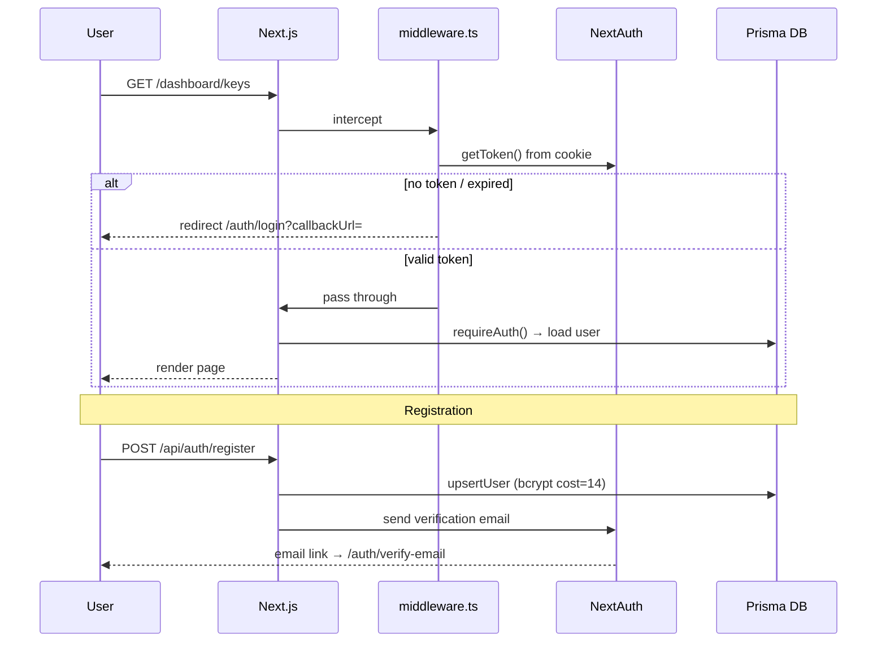
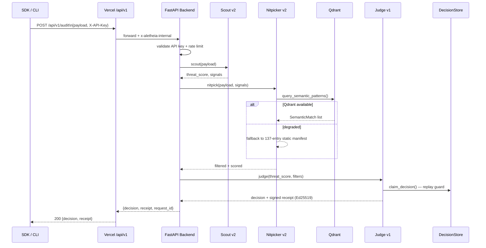

# Aletheia Core — Site Architecture Diagram

## Full Request & Data Flow

```mermaid
flowchart TD
    Browser["Browser / SDK Client"]

    subgraph Vercel["Vercel (Next.js 14 — app.aletheia-core.com)"]
        MW["middleware.ts\nCSRF · HSTS · CSP · auth guard\nHost-based routing"]

        subgraph PublicPages["Public Pages"]
            Home["/"]
            Demo["/demo"]
            Blog["/blog"]
            Pricing["/pricing"]
            Verify["/verify"]
            Changelog["/changelog"]
            CLI["/cli"]
            Docs["/docs"]
            Solutions["Solution SEO pages\n/ai-agent-security …"]
            Legal["/legal/*"]
        end

        subgraph AuthPages["Auth Pages"]
            Login["/auth/login"]
            Register["/auth/register"]
            VerifyEmail["/auth/verify-email"]
            AuthError["/auth/error"]
        end

        subgraph ProtectedPages["Protected Dashboard (session required)"]
            Onboarding["/onboarding"]
            Dashboard["/dashboard"]
            Keys["/dashboard/keys"]
            Logs["/dashboard/logs"]
            Evidence["/dashboard/evidence"]
            Policy["/dashboard/policy"]
            Settings["/dashboard/settings"]
            Usage["/dashboard/usage"]
        end

        subgraph APIRoutes["API Routes (app/api/)"]
            subgraph AuthAPI["Auth"]
                NextAuth["/api/auth/[...nextauth]\nGitHub · Google OAuth"]
                RegAPI["/api/auth/register\nPOST — bcrypt hash, SendGrid verify"]
                VerifyAPI["/api/auth/verify-email\nGET — token lookup"]
            end

            subgraph KeysAPI["Key Management"]
                KeysGET["/api/keys\nGET — list user keys"]
                KeysPOST["/api/keys\nPOST — create key (plan limit)"]
                KeyID["/api/keys/[id]\nGET quota · DELETE revoke"]
            end

            subgraph LogsAPI["Audit Logs"]
                LogsGET["/api/logs\nGET ?page&limit&decision&action"]
                LogID["/api/logs/[id]\nGET — full receipt JSON"]
            end

            subgraph AccountAPI["Account"]
                AccountPATCH["/api/account\nPATCH — update name"]
                AccountDEL["/api/account\nDELETE — soft delete"]
                Export["/api/account/export\nPOST — rate limited 1x/24h"]
            end

            subgraph DemoAPI["Demo (public, rate limited)"]
                DemoPost["/api/demo\nPOST — proxies to backend\nuses ALETHEIA_DEMO_API_KEY"]
                DemoOrigins["/api/demo/origins\nGET — CORS allowlist"]
            end

            ProxyGW["/api/v1/[...path]\nForward to Python backend\nInjects x-aletheia-internal"]

            subgraph BillingAPI["Billing"]
                Checkout["/api/stripe/checkout\nPOST — create Stripe session"]
                Webhook["/api/webhooks/stripe\nPOST — signature verified\nupdate user.plan"]
            end

            subgraph OpsAPI["Operational"]
                Health["/api/health\nGET — env check"]
                Cron["/api/cron/report-usage\nPOST — CRON_SECRET bearer"]
                Policy2["/api/policy\nGET — Ed25519-signed manifest"]
                OnboardAPI["/api/onboarding\nGET · POST"]
                SettingsAPI["/api/settings\nGET"]
                WellKnown["/.well-known/*\nreceipt + manifest PEM keys"]
            end
        end

        subgraph Lib["lib/ Shared Utilities"]
            Auth["auth.ts\nauthOptions · extractClientIp\nconsumeLoginRateLimit"]
            ServerAuth["server-auth.ts\nrequireAuth · getAuth"]
            PrismaLib["prisma.ts\nPrisma singleton"]
            RateLib["rate-limit.ts\nconsumeRateLimit (IP-based)"]
            EmailLib["email.ts\nSendGrid · Resend"]
            Plans["hosted-plans.ts\nplan limits · Stripe price IDs"]
            SiteConf["site-config.ts\nORIGINS · PRICING · URLS"]
            UsageLib["usage-tracking.ts\nincrementUsage"]
            APIUtils["api-utils.ts\nsecureJson · apiError"]
        end
    end

    subgraph Render["Render (Python FastAPI — aletheia-core.onrender.com)"]
        BEHealth["/health · /ready\nQdrant · Redis · Postgres status"]
        PubKey["/v1/public-key\n/.well-known/*.pem"]
        Evaluate["/v1/evaluate\nPOST — lightweight, no receipt"]
        Audit["/v1/audit\nPOST — full signed receipt"]
        Trifecta["/v1/agent-trifecta/audit\nPOST — PROCEED / REVIEW / DENIED"]
        KeyMgmt["/v1/keys\nGET · POST · DELETE"]
        Rotate["/v1/rotate\nPOST — hot-rotate secrets"]
        WSAudit["/ws/audit\nWebSocket — live PII-redacted stream"]
        Metrics["/metrics\nPrometheus (METRICS_ENABLED)"]

        subgraph Pipeline["Agent Pipeline"]
            Scout["Scout v2\nthreat detection"]
            Nitpicker["Nitpicker v2\nsemantic filter\n+ static manifest fallback"]
            Judge["Judge v1\ndecision + receipt signing"]
        end

        subgraph BackendCore["Core Modules"]
            KeyStore["KeyStore\nSQLite | Postgres"]
            DecisionStore["DecisionStore\nreplay guard · bundle drift"]
            AuditLog["AuditLog\ntamper-evident receipts"]
            RateLimit["RateLimit\nRedis / Upstash sliding window"]
            RuntimeSec["RuntimeSecurity\nnormalization · sandbox"]
        end
    end

    subgraph ExternalServices["External Services"]
        Stripe["Stripe\nbilling · webhooks"]
        SendGrid["SendGrid / Resend\nemail verification"]
        NextAuthProv["GitHub OAuth\nGoogle OAuth"]
        Prisma["Prisma ORM\nPostgres / SQLite\n(users · keys · logs · profiles)"]
        Redis["Redis / Upstash\nrate limiting · sessions"]
        Qdrant["Qdrant\nvector search\nALETHEIA_SEMANTIC_ENABLED=true"]
        Codecov["Codecov\ncoverage reports"]
    end

    Browser --> MW
    MW -->|"protected paths"| ServerAuth
    MW -->|"public paths"| PublicPages
    MW -->|"auth paths"| AuthPages
    ServerAuth --> ProtectedPages

    Register --> RegAPI --> EmailLib --> SendGrid
    Login --> NextAuth --> NextAuthProv
    Login --> Auth --> RateLib --> Redis

    Keys --> KeysGET & KeysPOST & KeyID
    KeysGET & KeysPOST & KeyID --> PrismaLib --> Prisma

    Logs --> LogsGET & LogID --> PrismaLib

    Demo --> DemoPost --> DemoAPI
    DemoPost -->|"ALETHEIA_DEMO_API_KEY"| ProxyGW

    ProxyGW -->|"x-aletheia-internal\n+ original API key"| Audit
    ProxyGW --> Evaluate
    ProxyGW --> Trifecta
    ProxyGW --> KeyMgmt

    Checkout --> Stripe
    Webhook -->|"Stripe-Signature"| Stripe

    Cron -->|"CRON_SECRET"| UsageLib --> PrismaLib

    Audit --> Scout --> Nitpicker --> Judge
    Nitpicker -->|"ALETHEIA_SEMANTIC_ENABLED"| Qdrant
    Nitpicker -->|"degraded fallback"| BackendCore
    Judge --> AuditLog
    Judge --> DecisionStore
    Audit --> RateLimit --> Redis
    Audit --> KeyStore

    Onboarding --> OnboardAPI --> PrismaLib
    Usage --> UsageLib
    Evidence --> LogID
    Policy --> Policy2

    AccountDEL & AccountPATCH & Export --> AccountAPI --> PrismaLib
```

---

## Auth & Session Flow

---

## Audit Request Flow (SDK → Receipt)

---

## Environment Variable Quick Reference

| Variable | Layer | Required | Notes |
|---|---|---|---|
| `NEXTAUTH_SECRET` | Frontend | **Yes** | min 32 chars |
| `NEXTAUTH_URL` | Frontend | **Yes** | e.g. `https://app.aletheia-core.com` |
| `DATABASE_URL` | Both | **Yes** | Postgres (separate Prisma + asyncpg pools) |
| `ALETHEIA_RECEIPT_SECRET` | Backend | **Yes** | min 32 chars, HMAC fallback |
| `SIGNING_SECRET` | Backend | Prod | min 32 chars |
| `ALETHEIA_KEY_SALT` | Backend | Prod | key derivation salt |
| `ALETHEIA_ALIAS_SALT` | Backend | Prod | fallback for rotation salt |
| `STRIPE_SECRET_KEY` | Frontend | Billing | Stripe API key |
| `STRIPE_WEBHOOK_SECRET` | Frontend | Billing | webhook signature |
| `ALETHEIA_INTERNAL_SECRET` | Both | Prod | Vercel→Render trust header |
| `ALETHEIA_DEMO_API_KEY` | Both | Prod | demo proxy key |
| `UPSTASH_REDIS_REST_URL` | Backend | Prod | distributed rate limiting |
| `UPSTASH_REDIS_REST_TOKEN` | Backend | Prod | Upstash auth |
| `ALETHEIA_SEMANTIC_ENABLED` | Backend | Qdrant | `true` to enable vector search |
| `ALETHEIA_QDRANT_URL` | Backend | Qdrant | e.g. `http://localhost:6333` |
| `ALETHEIA_QDRANT_API_KEY` | Backend | Qdrant Cloud | leave blank for local |
| `GITHUB_CLIENT_ID` | Frontend | OAuth | optional GitHub login |
| `GITHUB_CLIENT_SECRET` | Frontend | OAuth | optional GitHub login |
| `GOOGLE_CLIENT_ID` | Frontend | OAuth | optional Google login |
| `GOOGLE_CLIENT_SECRET` | Frontend | OAuth | optional Google login |
| `RESEND_API_KEY` | Frontend | Email | verification emails |
| `CRON_SECRET` | Frontend | Cron | cron endpoint auth |
| `SLACK_WEBHOOK_URL` | Frontend | Alerts | usage report notifications |
